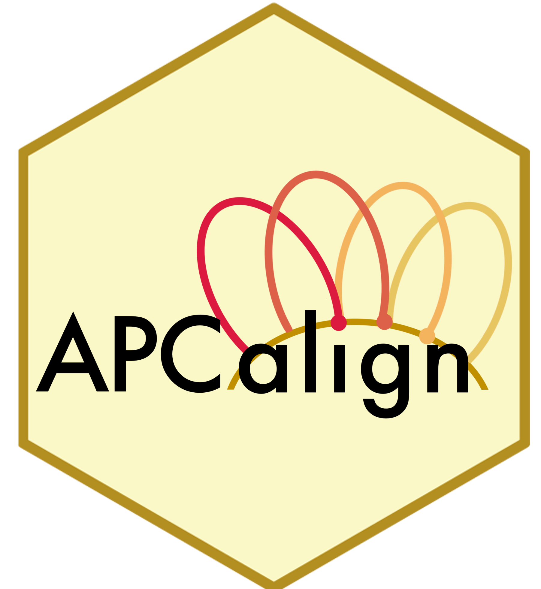
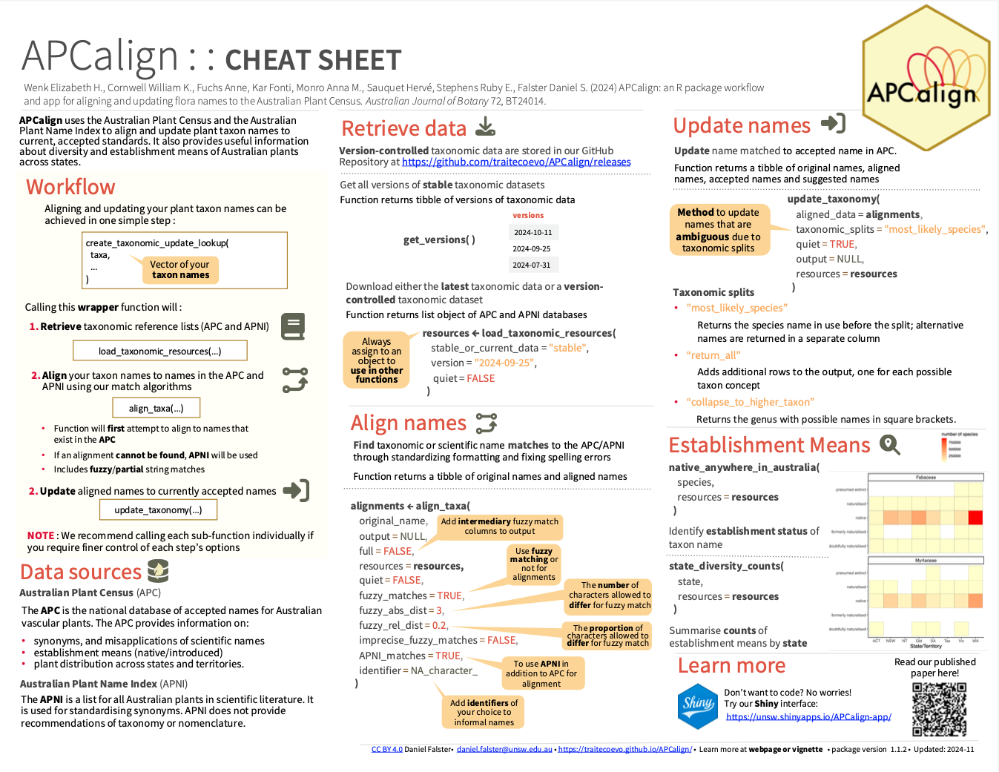

<!-- README.md is generated from README.Rmd. Please edit that file -->

```{r, include = FALSE}
knitr::opts_chunk$set(
  collapse = TRUE,
  comment = "#>",
  fig.path = "man/figures/README-",
  out.width = "100%"
)

library(APCalign)
```

<!-- badges: start -->
[](https://lifecycle.r-lib.org/articles/stages.html#stable)
[](https://cran.r-project.org/package=APCalign)
[](https://app.codecov.io/gh/traitecoevo/APCalign?branch=master)
[](https://github.com/traitecoevo/APCalign/actions/workflows/R-CMD-check.yaml)
<!-- badges: end -->

# APCalign 

When working with biodiversity data, it is important to verify taxonomic names with an authoritative list and correct any out-of-date names or names with typos.

The 'APCalign' package simplifies this process by:

-   Accessing up-to-date taxonomic information from the [Australian Plant Census](https://biodiversity.org.au/nsl/services/search/taxonomy) and the [Australia Plant Name Index](https://biodiversity.org.au/nsl/services/search/names).
-   Aligning authoritative names to your taxonomic names using our [fuzzy matching algorithm](https://traitecoevo.github.io/APCalign/articles/updating-taxon-names.html)
-   Updating your taxonomic names in a transparent, reproducible manner
-   Because APCalign was developed explicitly for the Australian flora it handles phrase names and aligns disparate phrase name syntax
-   Indicating when a split leads to uncertainty in a name alignment

'APCalign' also supplies information about the established status (i.e., native/introduced) of plant taxa within different states/territories as compiled by the APC. It's useful for updating species list and intersecting them with the APC consensus for both taxonomy and establishment status.

Read the [APCalign paper](https://doi.org/10.1071/BT24014) to learn more about the motivations for this project and our fuzzy matching and aligning algorithms. 

## Installation 🛠️

From CRAN:

```{r install, eval= FALSE}
install.packages("APCalign")

library(APCalign)
```
 
OR for the GitHub version:
 
```{r install2, eval= FALSE}
install.packages("remotes")
remotes::install_github("traitecoevo/APCalign")
```

Or for the ShinyApp head to [app.austraits.org/APCalign-app](https://app.austraits.org/APCalign-app/)

## A quick demo

Generating a look-up table can be done with just one function:

```{r,message=FALSE}
create_taxonomic_update_lookup( 
  taxa = c(
    "Banksia integrifolia",
    "Acacia longifolia",
    "Commersonia rosea"
    )
)
```

You can alternatively load the taxonomic resources into memory first:

```{r,message=FALSE}
tax_resources <- load_taxonomic_resources()

create_taxonomic_update_lookup( 
  taxa = c(
    "Banksia integrifolia",
    "Banksya integrifolla",
    "Banksya integriifolla",
    "Banksyya integriifolla",
    "Banksia red flowers",
    "Banksia sp.",
    "Banksia catoglypta",
    "Dryandra catoglypta",
    "Dryandra cataglypta",
    "Dryandra australis",
    "Acacia longifolia",
    "Commersonia rosea",
    "Panicum sp. Hairy glumes (C.R.Michell 4192)",
    "Panicum sp. Hairy glumes (Michell)",
    "Panicum sp. Hairy glumes",
    "not a species"
    ),
  resources = tax_resources
)
```

Checking for a list of species to see if they are classified as Australian natives:

```{r, message=FALSE}
native_anywhere_in_australia(c("Eucalyptus globulus","Pinus radiata"), resources = tax_resources)
```

Determining the number of species present in NSW and their establishment means:
```{r, message=FALSE}
state_diversity_counts("NSW", resources = tax_resources)
```

The related function `create_species_state_origin_matrix()` generates a table for all taxa in Australia, indicating their distribution and establishment means, by state.


Getting a family lookup table for genera from the specified taxonomy:

```{r, message=FALSE}
get_apc_genus_family_lookup(c("Eucalyptus",
                              "Pinus",
                              "Actinotus",
                              "Banksia",
                              "Acacia",
                              "Triodia"), 
                            resources = tax_resources)
```

Compiling a list of outdated synonyms for currently accepted names:

```{r, message=FALSE}
names_to_check <- c("Acacia aneura", "Banksia nivea", "Cardamine gunnii", "Stenocarpus sinuatus")
synonyms_for_accepted_names(resources = tax_resources, accepted_names = names_to_check, collapse = T)
```


## Cheatsheet

<a href="https://github.com/traitecoevo/APCalign/blob/master/inst/cheatsheet/APCalign-cheatsheet.pdf"></a>

## Learn more 📚

Highly recommend looking at our [Getting Started](https://traitecoevo.github.io/APCalign/articles/APCalign.html) vignette to learn about how to use `APCalign`. You can also learn more about our [taxa matching  algorithm](https://traitecoevo.github.io/APCalign/articles/updating-taxon-names.html).

## Show us support 💛

Please consider citing our work, we are really proud of it!

```{r}
citation("APCalign")
```

## Found a bug? 🐛

Did you come across an unexpected taxon name change? Elusive error you can't debug - [submit an issue](https://github.com/traitecoevo/APCalign/issues) and we will try our best to help.

## Comments and contributions

We welcome any comments and contributions to the package, start by [submit an issue](https://github.com/traitecoevo/APCalign/issues) and we can take it from there!

## AusTraits family

`APCalign` is part of the **AusTraits family** of packages maintained by the
[AusTraits](https://austraits.org) team. See **[austraits.org](https://austraits.org)** for the
project, the data, and the people behind it.

Contributing? Issues across the family are tracked on one board,
[AusTraits #9](https://github.com/orgs/traitecoevo/projects/9), and new issues are auto-added. Please
read the [issue & labelling guide](https://github.com/traitecoevo/austraits-meta/blob/main/governance/issue-guide.md)
in [`austraits-meta`](https://github.com/traitecoevo/austraits-meta) — the family's cross-package
knowledge and governance hub — before filing.


## Acknowledgements

AusTraits is made possible by contributions from our partner organisations — the
[University of New South Wales](https://www.unsw.edu.au/),
[Western Sydney University](https://www.westernsydney.edu.au/),
[Botanic Gardens of Sydney](https://www.botanicgardens.org.au/),
[the University of Melbourne](https://www.unimelb.edu.au/),
the [Atlas of Living Australia](https://www.ala.org.au/), and the Australian Government
[Department of Climate Change, Energy, the Environment and Water](https://www.dcceew.gov.au) — and
from our [advisory board, data contributors, and past partners](https://austraits.org/team/team-partners.html).

AusTraits is a co-investment partnership with the
[Australian Research Data Commons](https://ardc.edu.au/) (ARDC) through the Planet Research Data
Commons ([DOI: 10.3565/nyk4-4r91](https://doi.org/10.3565/nyk4-4r91)). The ARDC is enabled by the
Australian Government's [National Collaborative Research Infrastructure Strategy](https://www.education.gov.au/ncris)
(NCRIS).
