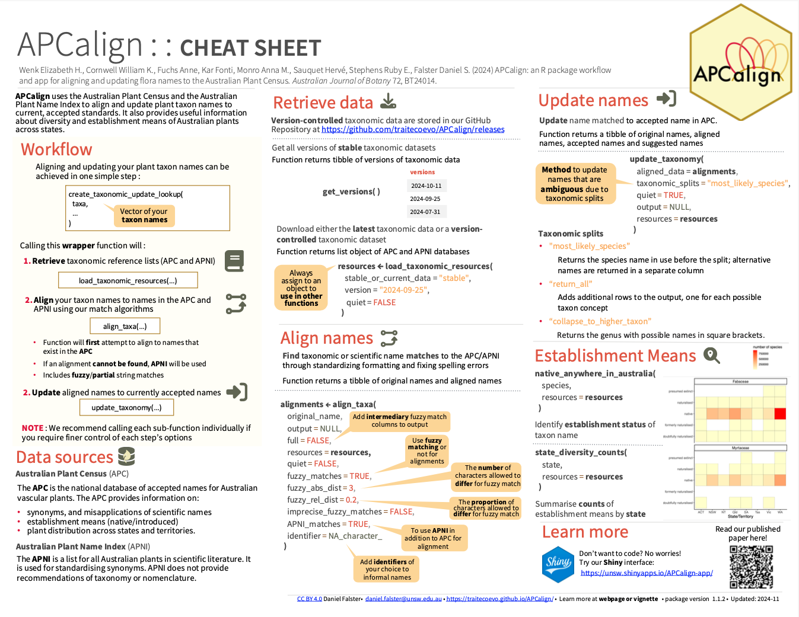

<!-- README.md is generated from README.Rmd. Please edit that file -->
<!-- badges: start -->

[](https://lifecycle.r-lib.org/articles/stages.html#stable)
[](https://cran.r-project.org/package=APCalign)
[](https://app.codecov.io/gh/traitecoevo/APCalign?branch=master)
[](https://github.com/traitecoevo/APCalign/actions/workflows/R-CMD-check.yaml)
<!-- badges: end -->

# APCalign 

`APCalign` uses the [Australian Plant Census
(APC)](https://biodiversity.org.au/nsl/services/search/taxonomy) and
[Australian Plant Name
Index](https://biodiversity.org.au/nsl/services/search/names) to align
and update Australian plant taxon name strings. ‘APCalign’ also supplies
information about the established status (native/introduced) of plant
taxa across different states/territories. It’s useful for updating
species list and intersecting them with the APC consensus understanding
of established status (native/introduced).

## Installation 🛠️

From CRAN:

``` r
 install.packages("APCalign")

library(APCalign)
```

OR for the GitHub version:

``` r
install.packages("remotes")
remotes::install_github("traitecoevo/APCalign")
```

## A quick demo

Generating a look-up table can be done with just one function:

``` r
create_taxonomic_update_lookup( 
  taxa = c(
    "Banksia integrifolia",
    "Acacia longifolia",
    "Commersonia rosea"
    )
)
```

    #> ================================================================================================================================================================
    #> # A tibble: 3 × 12
    #>   original_name       aligned_name accepted_name suggested_name genus taxon_rank
    #>   <chr>               <chr>        <chr>         <chr>          <chr> <chr>     
    #> 1 Banksia integrifol… Banksia int… Banksia inte… Banksia integ… Bank… species   
    #> 2 Acacia longifolia   Acacia long… Acacia longi… Acacia longif… Acac… species   
    #> 3 Commersonia rosea   Commersonia… Androcalva r… Androcalva ro… Andr… species   
    #> # ℹ 6 more variables: taxonomic_dataset <chr>, taxonomic_status <chr>,
    #> #   scientific_name <chr>, aligned_reason <chr>, update_reason <chr>,
    #> #   number_of_collapsed_taxa <dbl>

If you’re going to use `APCalign` more than once, it will save you time
to load the taxonomic resources into memory first:

``` r
tax_resources <- load_taxonomic_resources()
```

    #> ================================================================================================================================================================

    create_taxonomic_update_lookup( 
      taxa = c(
        "Banksia integrifolia",
        "Acacia longifolia",
        "Commersonia rosea",
        "not a species"
        ),
      resources = tax_resources
    )
    #> # A tibble: 4 × 12
    #>   original_name       aligned_name accepted_name suggested_name genus taxon_rank
    #>   <chr>               <chr>        <chr>         <chr>          <chr> <chr>     
    #> 1 Banksia integrifol… Banksia int… Banksia inte… Banksia integ… Bank… species   
    #> 2 Acacia longifolia   Acacia long… Acacia longi… Acacia longif… Acac… species   
    #> 3 Commersonia rosea   Commersonia… Androcalva r… Androcalva ro… Andr… species   
    #> 4 not a species       <NA>         <NA>          <NA>           <NA>  <NA>      
    #> # ℹ 6 more variables: taxonomic_dataset <chr>, taxonomic_status <chr>,
    #> #   scientific_name <chr>, aligned_reason <chr>, update_reason <chr>,
    #> #   number_of_collapsed_taxa <dbl>

Checking for a list of species to see if they are classified as
Australian natives:

``` r
native_anywhere_in_australia(c("Eucalyptus globulus","Pinus radiata"), resources = tax_resources)
#> # A tibble: 2 × 2
#>   species             native_anywhere_in_aus
#>   <chr>               <chr>                 
#> 1 Eucalyptus globulus native                
#> 2 Pinus radiata       introduced
```

Getting a family lookup table for genera from the specified taxonomy:

``` r
get_apc_genus_family_lookup(c("Eucalyptus",
                              "Pinus",
                              "Actinotus",
                              "Banksia",
                              "Acacia",
                              "Triodia"), 
                            resources = tax_resources)
#> # A tibble: 6 × 2
#>   genus      family    
#>   <chr>      <chr>     
#> 1 Eucalyptus Myrtaceae 
#> 2 Pinus      Pinaceae  
#> 3 Actinotus  Apiaceae  
#> 4 Banksia    Proteaceae
#> 5 Acacia     Fabaceae  
#> 6 Triodia    Poaceae
```

## Shiny application ✨

We also developed a shiny application for non-R users to update and
align their taxonomic names. You can find the application here:
<https://unsw.shinyapps.io/APCalign-app>

## Cheatsheet

<a href="https://github.com/traitecoevo/APCalign/tree/master/inst/cheatsheet/APCalign-cheatsheet.pdf"></a>

## Learn more 📚

Highly recommend looking at our [Getting
Started](https://traitecoevo.github.io/APCalign/articles/APCalign.html)
vignette to learn about how to use `APCalign`. You can also learn more
about our [taxa matching
algorithm](https://traitecoevo.github.io/APCalign/articles/updating-taxon-names.html).

## Show us support 💚

Please consider citing our work, we are really proud of it!

``` r
citation("APCalign")
#> To cite package 'APCalign' in publications use:
#> 
#>   Wenk E, Cornwell W, Fuchs A, Kar F, Monro A, Sauquet H, Stephens R,
#>   Falster D (2024). "APCalign: an R package workflow and app for
#>   aligning and updating flora names to the Australian Plant Census."
#>   _Australian Journal of Botany_. R package version: 1.0.1,
#>   <https://www.biorxiv.org/content/10.1101/2024.02.02.578715v1>.
#> 
#> A BibTeX entry for LaTeX users is
#> 
#>   @Article{,
#>     title = {APCalign: an R package workflow and app for aligning and updating flora names to the Australian Plant Census},
#>     journal = {Australian Journal of Botany},
#>     author = {Elizabeth Wenk and Will Cornwell and Ann Fuchs and Fonti Kar and Anna Monro and Herve Sauquet and Ruby Stephens and Daniel Falster},
#>     year = {2024},
#>     note = {R package version: 1.0.1},
#>     url = {https://www.biorxiv.org/content/10.1101/2024.02.02.578715v1},
#>   }
```

## Found a bug? 🐛

Did you come across an unexpected taxon name change? Elusive error you
can’t debug - [submit an
issue](https://github.com/traitecoevo/APCalign/issues) and we will try
our best to help.

## Comments and contributions

We welcome any comments and contributions to the package, start by
[submit an issue](https://github.com/traitecoevo/APCalign/issues) and we
can take it from there!
