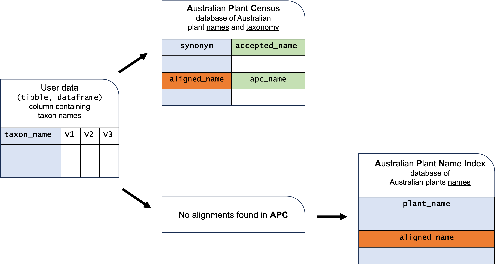

```{r, include = FALSE}
knitr::opts_chunk$set(
  collapse = TRUE,
  comment = "#>"
)

library(APCalign)
library(readr)
library(dplyr)

```



## Australian Plant Census (APC)

The [Australian Plant Census (APC)](https://biodiversity.org.au/nsl/services/search/taxonomy) is the national taxonomic database of accepted names for [Australian vascular plants](https://bie.ala.org.au/species/NZOR-6-33408). The APC includes information on synonyms, and misapplications of them, as well as established status (native/introduced) and distribution across states and territories. 

'APCalign' will first attempt to align your plant names to scientific names that exist in the APC.

## Australian Plant Names Index (APNI)

The [Australian Plant Names Index (APNI)](https://www.anbg.gov.au/apni/) is a database containing all names used for Australian plants in scientific literature. It is primarily used by the botanical community for standardising synonyms. Importantly, APNI does not provide recommendations of taxonomy or nomenclature; only the APC indicates which taxonomy is considered accepted. 

'APCalign' uses APNI when an alignment cannot be found in the APC.

## Data standards and meta-data
Data from both APNI and APC are formatted according to the [Darwin Core standard](https://dwc.tdwg.org/terms/), a widely used data standard for biodiversity data. 

You can find the meta-data for the APC and APNI below: 

- [Meta-data for APC output](https://ibis-cloud.atlassian.net/wiki/spaces/NP/pages/1154383943/NSL+Taxon+export+format)
- [Meta-data for APNI output](https://ibis-cloud.atlassian.net/wiki/spaces/NP/pages/1154383919/NSL+Name+export+format)

For more details on APNI and APC, we recommend taking a read of [their extensive documentation](https://ibis-cloud.atlassian.net/wiki/spaces/NP/pages/1380483087/NSL+API+Documentation#1.-Introduction).


